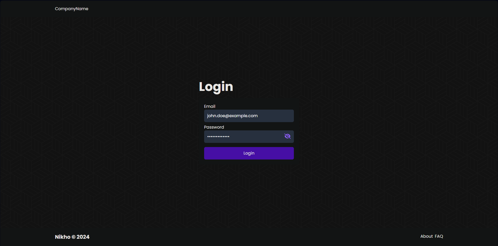
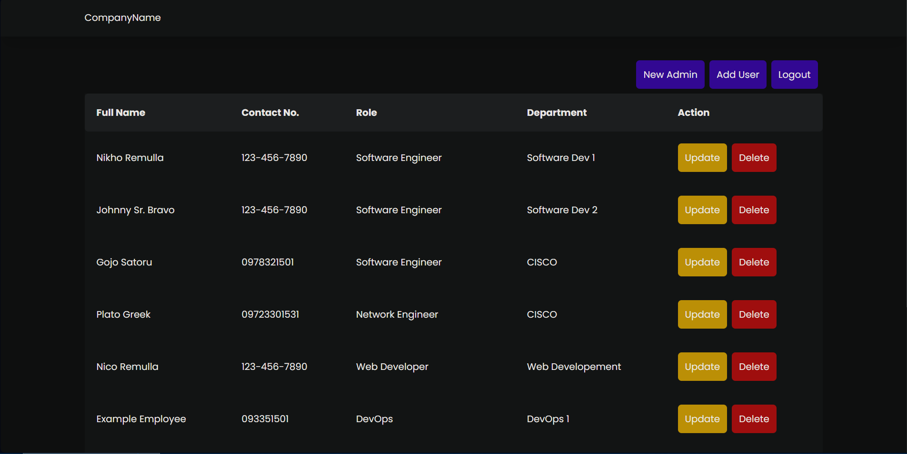
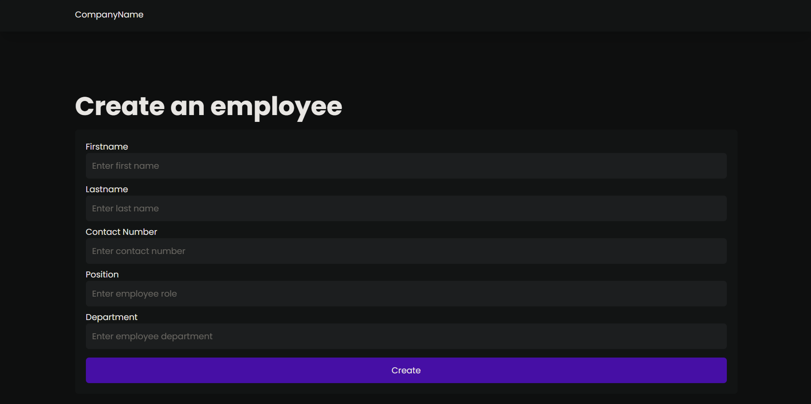
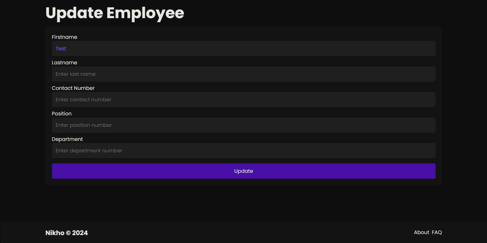

<a name="readme-top"></a>
<!-- TABLE OF CONTENTS -->
<details>
  <summary>Table of Contents</summary>
  <ol>
    <li>
      <a href="#about-the-project">About The Project</a>
      <ul>
        <li><a href="#built-with">Built With</a></li>
      </ul>
    </li>
    <li>
      <a href="#getting-started">Getting Started</a>
      <ul>
        <li><a href="#prerequisites">Prerequisites</a></li>
        <li><a href="#installation">Installation</a></li>
      </ul>
    </li>
       <li>
      <a href="#api-routes">Routes</a>
      <ul>
           <li><a href="#api-routes">API Routes</a></li>
      </ul>
    </li>
    <li><a href="#roadmap">Roadmap</a></li>
    <li><a href="#contributing">Contributing</a></li>

  </ol>
</details>


<!-- ABOUT THE PROJECT -->
## About The Project
This project is a full-stack Employee Management System built using the MERN stack (MongoDB, Express.js, React.js, and Node.js). It provides a comprehensive solution for managing employee data within an organization. This project focuses on the backend API development for the Employee Management System. You can extend this project by building a React application for user interaction and data visualization.







<p align="right">(<a href="#readme-top">back to top</a>)</p>

### Features
1. Authentication: Users can register and log in using a secure JWT (JSON Web Token) based authentication system.
2. CRUD Operations: The system allows creation (C), retrieval (R), update (U), and deletion (D) of employee data.
3. Database: MongoDB is used to store employee information with Mongoose as an object data modeling (ODM) layer.
4. Security: Bcrypt is used for password hashing to ensure secure storage of user credentials.
5. Error & Request Logging: The backend implements logging for errors and incoming requests to facilitate troubleshooting and monitoring.

<p align="right">(<a href="#readme-top">back to top</a>)</p>


### Built With


* [![mongodb.com][mongodb.com]][MONGODB-URL]
* [![expressjs.com][expressjs.com]][EXPRESS-URL]
* [![react.dev][react.dev]][REACT-URL]
* [![nodejs.com][nodejs.com]][NODEJS-URL]

<p align="right">(<a href="#readme-top">back to top</a>)</p>

<!-- GETTING STARTED -->
## Getting Started

Download all the prerequisites below in order.

### Prerequisites
Download all of these to get started. _Please also install packages used, this can be found in packages.json_

* [NodeJS](https://nodejs.org/en/download/)
* [Express](https://expressjs.com/en/starter/installing.html)
* [monogodb](https://www.mongodb.com/cloud/atlas/lp/try4?utm_content=rlsavisitor&utm_source=google&utm_campaign=search_gs_pl_evergreen_atlas_core_retarget-brand_gic-null_apac-all_ps-all_desktop_eng_lead&utm_term=mongodb&utm_medium=cpc_paid_search&utm_ad=e&utm_ad_campaign_id=14412646476&adgroup=131761130812&cq_cmp=14412646476&gad_source=1&gclid=EAIaIQobChMI64LU4ZbbhAMVeVUPAh156wLtEAAYASAAEgJQTfD_BwE)
* [mongoose](https://mongoosejs.com/docs/)
* [bcrypt](https://www.npmjs.com/package/bcrypt)
* [jsonwebtoken](https://jwt.io)
* [date-fns](https://www.npmjs.com/package/date-fns)
* [express-async-handler-fns](https://www.npmjs.com/package/express-async-handler)
* [uuid](https://www.npmjs.com/package/uuid)
* [express-rate-limit](https://www.npmjs.com/package/express-rate-limit)


### Installation

_Once installed, open a command prompt, choose your directory wherein you want to save the project. Finally, clone the repo._


1. Clone the repo.
   ```sh
   C:\Users\PC> git clone https://github.com/neekho/Employee-Management.git
   ```
2. Go to the project folder.
   ```sh
   C:\Users\PC> cd EmployeeManagement
   ```
3. Open the project using your preferred editor.
   
4. Install all necessary packages, using npm install in the termial.
   
5. Create a .env config file, set your mongo db connection, access token secret, and refresh token secret
6. Run both backend and frontend servers using:
    ```sh
     C:\Users\PC>EmployeeManagement\backend > npm run devstart
     ```
    ```sh
     C:\Users\PC>EmployeeManagement\frontend > npm run start
     ```
<p align="right">(<a href="#readme-top">back to top</a>)</p>

___________________________________________________________________________________________________

### Backend Routes
For the simplicity of the project's main README.md, the in-depth documentation of the [Employee Management API](https://github.com/neekho/Employee-Management/tree/master/backend/requests) can be found in
backend > requests. In there, you can read about the different routes and requirments for each requests in this project so far.
___________________________________________________________________________________________________

### Frontend Routes
For the simplicity of the project's main README.md, the in-depth documentation of the [Front End RoutesI](https://github.com/neekho/Employee-Management/tree/master/backend/requests) can be found inside the fronent folder. In there, you can read about the different routes in navigating system.

<p align="right">(<a href="#readme-top">back to top</a>)</p>


___________________________________________________________________________________________________


<!-- ROADMAP -->
## Roadmap
 The MERN stack is well-suited for building scalable web applications.
- [ ] Refine the backend API endpoints for specific requirements like filtering, sorting, and searching employees.
- [ ] Implement unit and integration tests for the backend API.


<p align="right">(<a href="#readme-top">back to top</a>)</p>

___________________________________________________________________________________________________

<!-- CONTRIBUTING -->
## Contributing

Contributions are what make the open source community such an amazing place to learn, and create. Any contributions you make are **greatly appreciated**.

If you have a suggestion that would make this better, please fork the repo and create a pull request. You can also simply open an issue with the tag "enhancement".
Don't forget to give the project a star! Thanks again!

1. Fork the Project
2. Create your Feature Branch (`git checkout -b feature/AmazingFeature`)
3. Commit your Changes (`git commit -m 'Add some AmazingFeature'`)
4. Push to the Branch (`git push origin feature/AmazingFeature`)
5. Open a Pull Request

<p align="right">(<a href="#readme-top">back to top</a>)</p>


<!-- MARKDOWN LINKS & IMAGES -->
<!-- https://www.markdownguide.org/basic-syntax/#reference-style-links -->
[product-screenshot]: images/screenshot.png


[mongodb.com]: https://img.shields.io/badge/mongodb-32a852?style=for-the-badge&logo=mongodb&logoColor=white
[MONGODB-URL]: https://www.mongodb.com/cloud/atlas/lp/try4?utm_source=google&utm_campaign=search_gs_pl_evergreen_atlas_core_prosp-brand_gic-null_apac-ph_ps-all_desktop_eng_lead&utm_term=mongodb&utm_medium=cpc_paid_search&utm_ad=e&utm_ad_campaign_id=12212624359&adgroup=115749710543&cq_cmp=12212624359&gad_source=1&gclid=CjwKCAiAibeuBhAAEiwAiXBoJFEks3P9gPBahanfK_zudnNu9bZoU3Gid6wCerA7qfBjIlZmmkUmAxoC5RAQAvD_BwE

[expressjs.com]: https://img.shields.io/badge/express-121a13?style=for-the-badge&logo=express&logoColor=white
[EXPRESS-URL]: https://expressjs.com


[react.dev]: https://img.shields.io/badge/react-5991eb?style=for-the-badge&logo=react&logoColor=white
[REACT-URL]: https://react.dev

[nodejs.com]: https://img.shields.io/badge/nodejs-74a867?style=for-the-badge&logo=nodejs&logoColor=white
[NODEJS-URL]: https://nodejs.org/en

